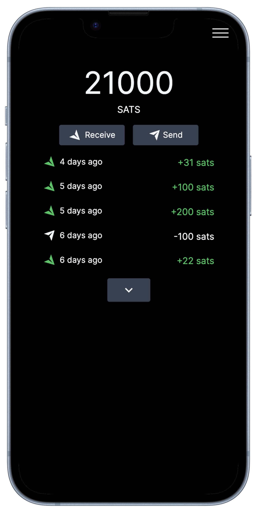

# lnF

Self-hosted Bitcoin Lightning Wallet based on [phoenixd](https://github.com/ACINQ/phoenixd).



## Pre-Requisite

Create docker network

```sh
docker network create lnf
```

Run `phoenixd` docker with network `lnf`

```sh
docker run --name phoenixd -dp 9740:9740 -v {DATA_PATH}:/phoenix/.phoenix/ --network lnf --restart unless-stopped ghcr.io/sethforprivacy/phoenixd
```

Price API documentation -> [here](https://rapidapi.com/coingecko/api/coingecko)

## Run api

Create file .env

```env
APP_VERSION=0.0.1
API_URL=http://phoenixd:9740
API_KEY=phoenixd_password
PINS=xxxxxx,yyyyyy
PRICE_API_KEY=2342343245
LINE_NOTIFY_TOKEN=xxxxxx # optional
```

```sh
docker run --name lnf-api -d --network lnf --restart unless-stopped --env-file .env -v {DATA_PATH}:/app/db ghcr.io/dnjooiopa/lnf-api
```

## Run web

```sh
docker run --name lnf-web -dp 9730:3000 --network lnf --restart unless-stopped ghcr.io/dnjooiopa/lnf-web
```

## Auto update

lnF

```sh
docker rm -f lnf-web
docker rm -f lnf-api

docker rmi ghcr.io/dnjooiopa/lnf-web
docker rmi ghcr.io/dnjooiopa/lnf-api

docker run --name lnf-api -d --network lnf --restart unless-stopped --env-file .env -v {DATA_PATH}:/app/db ghcr.io/dnjooiopa/lnf-api

docker run --name lnf-web -dp 9730:3000 --network lnf --restart unless-stopped ghcr.io/dnjooiopa/lnf-web
```

phoenixd

```sh
docker rm -f phoenixd

docker rmi ghcr.io/sethforprivacy/phoenixd

docker run --name phoenixd -dp 9740:9740 -v {DATA_PATH}:/phoenix/.phoenix/ --network lnf --restart unless-stopped ghcr.io/sethforprivacy/phoenixd
```
